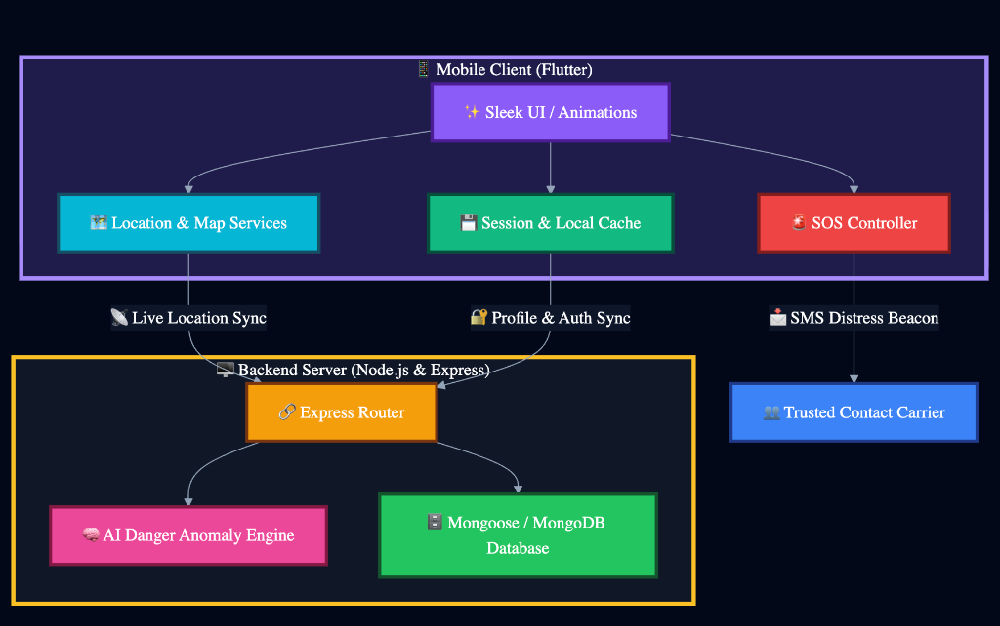

# 📡 AtlasWatch

**Stay Safe. Journey Informed. Never Walk Alone.**

AtlasWatch is a state-of-the-art, proactive personal safety companion designed to protect individuals on the go. Unlike traditional safety apps that only react after an emergency has occurred, AtlasWatch combines real-time location monitoring, predictive geospatial risk analysis, and automatic anomaly detection to protect you *before* danger strikes.

Whether you are walking home late at night, traveling in a new city, or commuting daily, AtlasWatch acts as your digital guardian, keeping your trusted contacts and local emergency services informed of your safety status.

---

## 🌟 The Core Vision

Personal safety is a fundamental right, yet navigating modern urban environments can be unpredictable. AtlasWatch is built on three core pillars:
1. **Preemptive Intelligence:** Using real-world crime data and coordinate-based risk assessment to dynamically warn users of high-threat zones.
2. **Automated Vigilance:** Continuous monitoring of motion anomalies (such as speed spikes or prolonged inactivity) to auto-trigger SOS safety procedures if a user becomes incapacitated.
3. **Frictionless Rescue:** Immediate one-touch and auto-activated distress signaling that bypasses the friction of finding, unlocking, and dialing on a phone during high-stress situations.

---

## 🛡️ Key Features

### 🧠 AI Anomaly & Danger Engine
At the heart of AtlasWatch is a backend intelligence system that constantly evaluates safety metrics:
* **Geofence & Danger Zones:** Real-time checking of user coordinates against curated safe, restricted, and high-risk zones.
* **Inactivity Detection:** Triggers an alert if a user stops moving unexpectedly for a prolonged duration (e.g., 10 minutes) without responding to check-ins.
* **Speed Spike Analysis:** Detects sudden acceleration anomalies that could indicate being forced into a vehicle or fleeing a threat.

### 🚨 Comprehensive SOS Suite
* **Instant Emergency Beacon:** A high-visibility, single-tap panic screen that immediately notifies pre-configured emergency contacts with your live location.
* **Acoustic Deterrent:** Integrated high-volume local siren to draw immediate physical attention and deter potential threats.
* **Automatic SOS:** Triggered seamlessly by the AI Danger Engine if high-risk anomalies are discovered during an active tracked journey.

### 📍 Live Journey Tracking
* **Safe Navigation Mode:** Activate live tracking for walks, rides, or runs. Trusted contacts can see your live position, active route risk level, and ETA.
* **Battery-Optimized Sync:** Intelligent background location synchronization updates your safety profile without draining your device's battery.
* **Proximity Risk Indicators:** Highlights the real-time safety status of your immediate location using real-world localized crime databases.

### 🔒 Secure travel Identity & Vault
* **Document Vault:** Safe, encrypted digital repository to store essential travel tickets, boarding passes, hotel reservations, and emergency documents.
* **Medical Profile:** Instantly displays vital responder information in the user profile, including expanded blood groups (standard & rare phenotypes like Bombay Oh and Rh-null), allergies, and chronic medical conditions.

---

## 🛠️ System Architecture

AtlasWatch is built as a robust full-stack solution:


### Technical Stack:
* **Frontend:** Flutter (Dart) utilizing premium responsive layouts, cascading fluid entrance animations, and standard mapping APIs (OpenStreetMap).
* **Backend:** Node.js, Express, MongoDB (Mongoose) for secure JSON APIs, real-time location streaming, and anomaly tracking.
* **Sensors & Integrations:** Geolocator, Geocoding, local storage caching (`shared_preferences`), and standard communication links (`url_launcher`).

---

## 📥 Installation & Setup

Get AtlasWatch running locally on your machine in just a few steps:

### Prerequisites
* Flutter SDK (Version `^3.10.0` or higher)
* Node.js (Version `^18.0.0` or higher)
* MongoDB (Local instance or MongoDB Atlas cluster URI)
* Android Emulator / iOS Simulator or a physical developer device

### 1. Set Up the Backend
1. Navigate to the `backend` folder:
   ```bash
   cd backend
   ```
2. Install dependencies:
   ```bash
   npm install
   ```
3. Create a `.env` file in the `backend` directory and add your MongoDB connection URI:
   ```env
   PORT=3000
   MONGODB_URI=mongodb://127.0.0.1:27017/atlaswatch
   ```
4. Start the backend server:
   ```bash
   npm start
   ```

### 2. Set Up the Mobile Client
1. Return to the project root directory.
2. Install Flutter packages:
   ```bash
   flutter pub get
   ```
3. Run the app on your connected device or emulator:
   ```bash
   flutter run
   ```

---

## 🔮 Future Vision
* **Peer-to-Peer Safe Networks:** Crowd-sourced community danger reporting and localized safety alerts.
* **Predictive Safe Routing:** AI-driven pathfinding that guides you through the statistically safest route rather than just the fastest route.
* **Wearable Extension:** Companion apps for Apple Watch and WearOS to trigger silent, wrist-worn distress signals.
