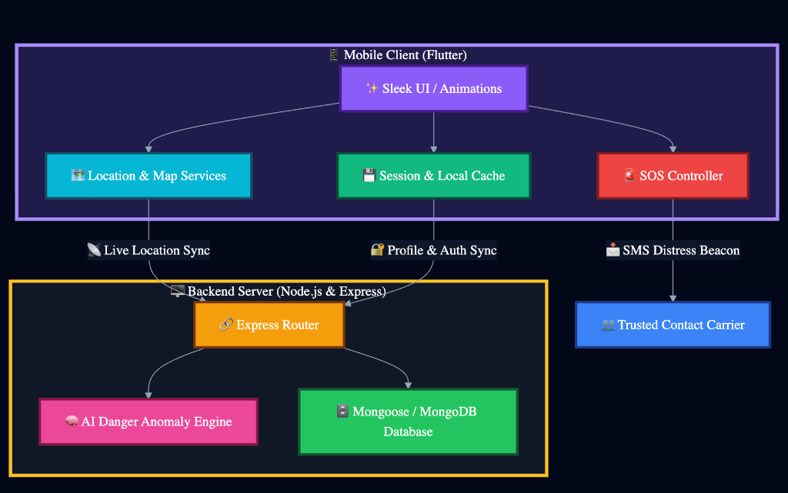

# 📡 AtlasWatch

**Stay Safe. Journey Informed. Never Walk Alone.**

AtlasWatch is a state-of-the-art, proactive personal safety companion designed to protect individuals on the go. Unlike traditional safety apps that only react after an emergency has occurred, AtlasWatch combines real-time location monitoring, predictive geospatial risk analysis, and automatic anomaly detection to protect you *before* danger strikes.

Whether you are walking home late at night, traveling in a new city, or commuting daily, AtlasWatch acts as your digital guardian, keeping your trusted contacts and local emergency services informed of your safety status.

---

## 🌟 The Core Vision

Personal safety is a fundamental right, yet navigating modern urban environments can be unpredictable. AtlasWatch is built on three core pillars:
1. **Preemptive Intelligence:** Using real-world crime data and coordinate-based risk assessment to dynamically warn users of high-threat zones.
2. **Automated Vigilance:** Continuous monitoring of motion anomalies (such as speed spikes or prolonged inactivity) to auto-trigger SOS safety procedures if a user becomes incapacitated.
3. **Frictionless Rescue:** Immediate one-touch and auto-activated distress signaling that bypasses the friction of finding, unlocking, and dialing on a phone during high-stress situations.

---

## 🛡️ Key Features

### 🧠 AI Anomaly & Danger Engine
At the heart of AtlasWatch is a backend intelligence system that constantly evaluates safety metrics:
* **Geofence & Danger Zones:** Real-time checking of user coordinates against curated safe, restricted, and high-risk zones.
* **Inactivity Detection:** Flags a user who has not moved more than 30 m over at least 8 minutes of tracked history.
* **Sudden Acceleration Analysis:** Flags a transition from walking pace to vehicle speed — the signal that matters — rather than any movement in a fixed speed band, so an ordinary bus ride is not an emergency.

### 🚨 Comprehensive SOS Suite
* **Instant Emergency Beacon:** A high-visibility, single-tap panic screen. The alert is raised on the server, which notifies your emergency contacts with your live location and responder-critical medical details; the app also pre-fills your own SMS app as a secondary channel.
* **Acoustic Deterrent:** Integrated high-volume local siren to draw immediate physical attention and deter potential threats.
* **Automatic SOS:** Triggered by the risk engine when a critical score coincides with a real situational signal — a high-risk geofence breach, prolonged unexpected inactivity, or fresh incident reports nearby. A high-crime area at a late hour raises a warning, not an automatic distress broadcast.

### 📍 Live Journey Tracking
* **Safe Navigation Mode:** Activate live tracking for walks, rides, or runs. Trusted contacts can see your live position, active route risk level, and ETA.
* **Battery-Optimized Sync:** Intelligent background location synchronization updates your safety profile without draining your device's battery.
* **Proximity Risk Indicators:** Highlights the real-time safety status of your immediate location using real-world localized crime databases.

### 🔒 Secure travel Identity & Vault
* **Document Vault:** Private repository for travel tickets, boarding passes, hotel reservations, and emergency documents. Uploads are restricted to images and PDFs, stored under unguessable names, and served only through an authenticated endpoint that checks ownership on every request. (Files are not yet encrypted at rest — that is a planned addition, see Future Vision.)
* **Medical Profile:** Instantly displays vital responder information in the user profile, including expanded blood groups (standard & rare phenotypes like Bombay Oh and Rh-null), allergies, and chronic medical conditions.

---

## 🛠️ System Architecture

AtlasWatch is built as a robust full-stack solution:


### Technical Stack:
* **Frontend:** Flutter (Dart) utilizing premium responsive layouts, cascading fluid entrance animations, and standard mapping APIs (OpenStreetMap).
* **Backend:** Node.js, Express, MongoDB (Mongoose) for JSON APIs, location history, and anomaly tracking. Authentication is JWT-based; operator endpoints are guarded by a separate admin key.
* **Operations Dashboard:** React + Vite console for live SOS dispatch and risk telemetry.
* **Sensors & Integrations:** Geolocator, Geocoding, local storage caching (`shared_preferences`), and standard communication links (`url_launcher`).

### Data flow

The crime dataset in `backend/data/crime_data.json` is the single source of truth:
the backend rule engine reads it, `npm run seed-crime-data` loads it into MongoDB,
and the Flutter client bundles the same file as an asset for offline scoring.

---

## 📥 Installation & Setup

Get AtlasWatch running locally on your machine in just a few steps:

### Prerequisites
* Flutter SDK (Version `^3.10.0` or higher)
* Node.js (Version `^18.0.0` or higher)
* MongoDB (Local instance or MongoDB Atlas cluster URI)
* Android Emulator / iOS Simulator or a physical developer device

### 1. Set Up the Backend
1. Navigate to the `backend` folder:
   ```bash
   cd backend
   ```
2. Install dependencies:
   ```bash
   npm install
   ```
3. Create `backend/.env` from the template and fill it in:
   ```bash
   cp .env.example .env
   ```
   ```env
   PORT=3000
   MONGODB_URI=mongodb://127.0.0.1:27017/atlaswatch
   # Generate each of these:
   #   node -e "console.log(require('crypto').randomBytes(32).toString('hex'))"
   JWT_SECRET=<32+ random characters>
   ADMIN_API_KEY=<32+ random characters>
   ```
   Both secrets are required in production. In development, missing values are
   replaced with ephemeral ones that reset on each restart.
4. Seed the crime dataset (once per database):
   ```bash
   npm run seed-crime-data
   ```
5. Start the backend server:
   ```bash
   npm start
   ```
   To send real SMS on SOS, also set `TWILIO_ACCOUNT_SID`, `TWILIO_AUTH_TOKEN` and
   `TWILIO_FROM_NUMBER`. Without them alerts are still recorded, and each intended
   recipient is marked `skipped` on the alert so the gap is visible.

### 2. Set Up the Mobile Client
1. Return to the project root directory.
2. Install Flutter packages:
   ```bash
   flutter pub get
   ```
3. Run the app on your connected device or emulator:
   ```bash
   flutter run
   ```
   In debug builds the client points at the standard local backend
   (`10.0.2.2:3000` on the Android emulator, `localhost:3000` elsewhere). For any
   other target — a physical device on your LAN, or a deployed backend — pass the
   URL explicitly:
   ```bash
   flutter run --dart-define=API_BASE_URL=https://your-backend.example.com
   ```
   A release build requires this flag.

### 3. Set Up the Operations Dashboard

```bash
cd dashboard
npm install
cp .env.example .env      # set VITE_API_URL if the backend is not on localhost:3000
npm run dev
```

The dashboard asks for the backend's `ADMIN_API_KEY` on first load and keeps it
for the browser tab only.

### Running the tests

```bash
cd backend && npm test    # risk rules, scoring engine, auth enforcement, API integration
flutter test              # dataset loading and tracking lifecycle
```

---

## 🔒 Security Model

* **User data is reached only through a session token.** Every user-scoped endpoint
  derives the account from a verified JWT; an email in a query string or body
  identifies nobody and is never used to select records.
* **Operator endpoints are separate.** `/admin/*`, SOS dispatch and geofence
  management require `ADMIN_API_KEY`, not a user session.
* **Location history is retained for 7 days** (configurable) via a TTL index. It
  exists to power anomaly detection, not to build a permanent movement record.
* **Secrets live in the environment.** Nothing in this repository should contain a
  real credential; if one is ever committed, rotate it — deleting the file does
  not remove it from git history.

## 🔮 Future Vision
* **Peer-to-Peer Safe Networks:** Crowd-sourced community danger reporting and localized safety alerts.
* **Predictive Safe Routing:** AI-driven pathfinding that guides you through the statistically safest route rather than just the fastest route.
* **Wearable Extension:** Companion apps for Apple Watch and WearOS to trigger silent, wrist-worn distress signals.
* **Encrypted Document Vault:** Envelope encryption for stored documents so files are unreadable at rest, not only access-controlled.
